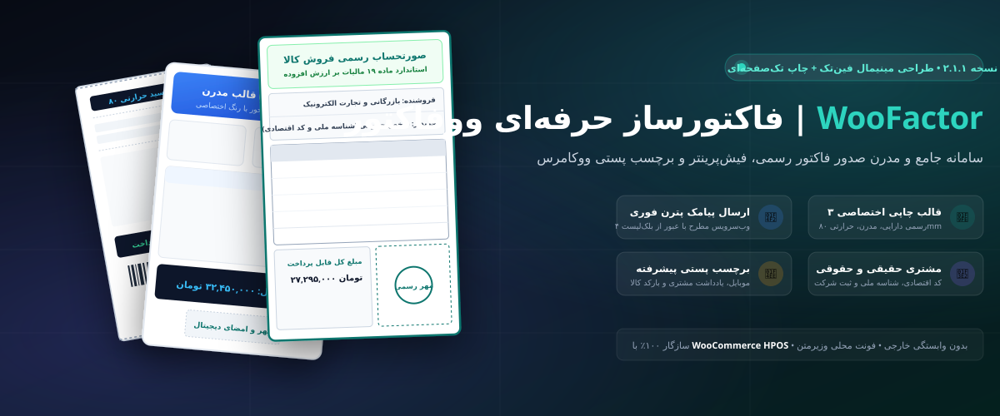
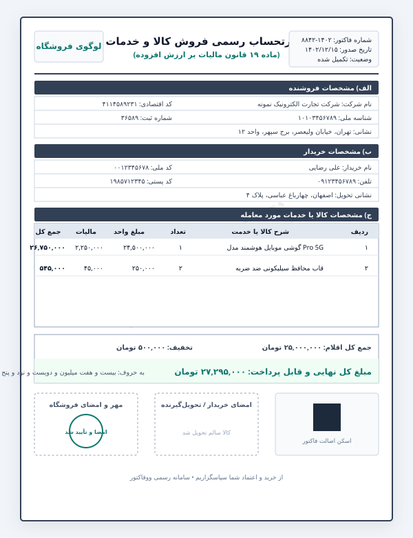
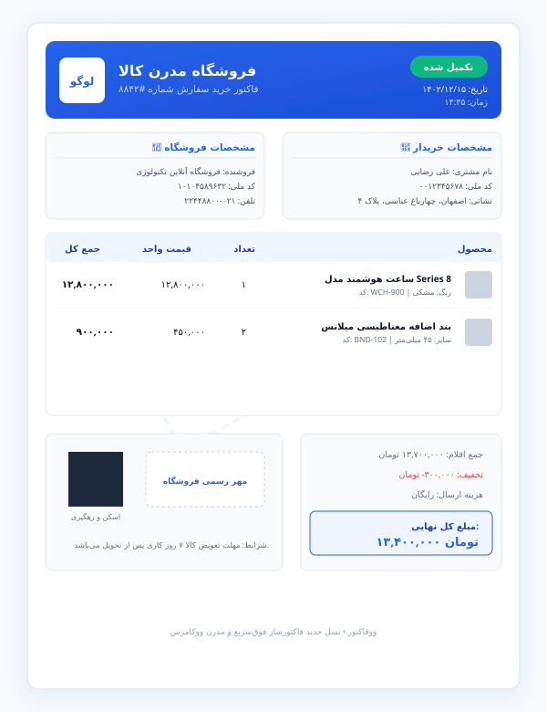
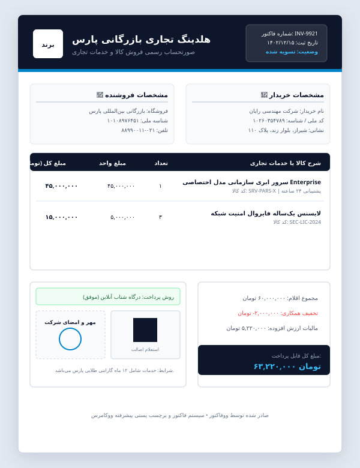

<div align="center">



# ووفاکتور | Woo Factor for WooCommerce

**پیشرفته‌ترین، زیباترین و کامل‌ترین افزونه صدور و چاپ فاکتور رسمی، تجاری و برچسب پستی برای ووکامرس**

[](https://github.com/Majidygh/woo-factor)
[](https://woocommerce.com/)
[](https://www.php.net/)
[](LICENSE)

[ویژگی‌های برتر](#-امکانات-و-قابلیت‌های-کلیدی) • [معرفی ۳ قالب فاکتور](#-معرفی-قالب‌های-فاکتور) • [راهنمای نصب](#-راهنمای-نصب-و-راه‌اندازی) • [صدور فاکتور دستی](#-صدور-فاکتور-دستی-مستقل) • [توسعه و هوک‌ها](#-هوک‌ها-و-شورت‌کدها)

</div>

---

## 💎 چرا «ووفاکتور» بهترین انتخاب است؟

افزونه **ووفاکتور (Woo Factor)** با بازطراحی کامل و افزودن استانداردهای روز حسابداری و تجارت الکترونیک، تجربه‌ای بی‌نظیر از صدور، نمایش و چاپ فاکتور برای فروشگاه‌های ووکامرسی فراهم می‌کند. تمام فونت‌ها به صورت محلی و خودمیزبان (Self-hosted) لود شده و هیچ وابستگی به CDN خارجی، سرور واسط یا وب‌سرویس‌های کند وجود ندارد.

---

## 🎨 معرفی قالب‌های فاکتور

ووفاکتور دارای **۳ طرح اختصاصی و بازطراحی‌شده** با بالاترین استانداردهای بصری و چاپی (A4 و A5) است:

### ۱. قالب رسمی و استاندارد دارایی (Classic / Tax Standard)
مطابق با قوانین و فرمت استاندارد **ماده ۱۹ قانون مالیات بر ارزش افزوده سازمان امور مالیاتی کشور**. دارای جدول کامل مشخصات مودی و خریدار (کد اقتصادی، شناسه ملی، شماره ثبت، کد پستی)، تفکیک مالیات و ارزش افزوده، تخفیف، مبالغ به حروف فارسی، کادر دوگانه مهر و امضا و بارکد و QR اعتبارسنجی.

<div align="center">
  
</div>

---

### ۲. قالب مدرن و کارت‌محور (Modern & Minimalist)
طراحی مدرن، سبک، بسیار چشم‌نواز و کارت‌بندی شده برای فروشگاه‌های آنلاین، کسب‌وکارهای دیجیتال و استارتاپ‌ها. دارای هدر گرادیانت داینامیک، نشانگرهای وضعیت سفارش، نمایش تصاویر بندانگشتی محصولات، باکس‌های خلاصه مالی و QR کد اختصاصی.

<div align="center">
  
</div>

---

### ۳. قالب تجاری و لوکس (Commercial Luxury)
طراحی با شکوه با تم سرمه‌ای و المان‌های رسمی برای شرکت‌های تجاری، فروشگاه‌های زنجیره‌ای و برندهای معتبر. دارای جدول اقلام با جزئیات کامل، اطلاعات حسابداری و پرداخت، کادر اصالت دیجیتال و محل مهر و امضای شرکتی.

<div align="center">
  
</div>

---

## ⚡ امکانات و قابلیت‌های کلیدی

- 🖨️ **۳ قالب کاملاً مجزا و ریسپانسیو**: رسمی دارایی، مدرن مینیمال و تجاری لوکس با امکان سوییچ سریع در پیش‌نمایش.
- 📱 **موتور اختصاصی تولید کد QR**: تولید کد QR کاملاً برداری (SVG) بدون نیاز به افزونه جانبی، GD یا اینترنت جهت اعتبارسنجی فاکتور با دوربین موبایل.
- 📊 **بارکد استاندارد خطی Code128**: برای اسکن سریع شماره سفارش توسط دستگاه‌های بارکدخوان در انبارداری.
- 🖼️ **آپلود تصویر مهر و امضای شفاف (PNG)**: قابلیت آپلود فایل مهر رسمی فروشگاه از کتابخانه وردپرس و درج خودکار در کادر مهر فاکتورها.
- 📦 **چاپ گروهی فاکتورها و برچسب‌ها (Bulk Actions)**: انتخاب همزمان چندین سفارش در مدیریت ووکامرس و دریافت خروجی یکپارچه آماده پرینت بدون باز شدن تب‌های متعدد.
- 🏷️ **برچسب پستی مرسوله (Shipping Label)**: برچسب استاندارد با تفکیک آدرس فرستنده و گیرنده، کد پستی برجسته، بارکد سفارش و لیست اقلام داخل مرسوله.
- 🛡️ **پشتیبانی کامل و رسمی از HPOS**: سازگاری ۱۰۰٪ با High-Performance Order Storage (سیستم جدید سفارشات ووکامرس) بدون هشدارهای ناسازگاری.
- 💧 **واترمارک هوشمند وضعیت سفارش**: نمایش مهر پس‌زمینه شیک متناسب با وضعیت («پرداخت شد»، «در انتظار پرداخت»، «باطل شد»، «پیش‌فاکتور»).
- ✍️ **تبدیل اتوماتیک مبلغ نهایی به حروف فارسی**: درج خوانای مبلغ کل به حروف فارسی (مانند: *بیست و هفت میلیون و پانصد هزار تومان*).
- 🖼️ **تصاویر بندانگشتی کالاها**: امکان فعال/غیرفعال کردن تصویر شاخص محصول در ردیف‌های فاکتور.
- ⚙️ **شخصی‌سازی کامل ستون‌ها**: امکان مدیریت نمایش کد محصول (SKU)، ستون تخفیف و ستون مالیات ارزش افزوده.
- 🔤 **فونت فارسی حرفه‌ای وزیرمتن (Vazirmatn)**: بارگذاری بهینه با فرمت‌های سبک WOFF2 و TTF بدون سنگین شدن خروجی HTML.
- 💳 **درج کد ملی و کد اقتصادی**: اضافه شدن خودکار فیلد کد ملی در صفحه تسویه حساب (Checkout) و ذخیره مستقیم روی سفارش.
- 📄 **پیش‌فاکتور آنی سبد خرید**: امکان چاپ یا ذخیره پیش‌فاکتور در مرحله تسویه حساب برای مشتریان.
- 📋 **کپی سریع لینک اختصاصی فاکتور**: دکمه ویژه در مدیریت سفارش جهت کپی فوری لینک امن فاکتور برای ارسال در پیام‌رسان‌ها به مشتری.
- ✉️ **دسترسی آسان در حساب کاربری و ایمیل**: نمایش خودکار دکمه چاپ فاکتور در صفحه سفارشات کاربر و در ایمیل‌های وضعیت سفارش.

---

## 🚀 راهنمای نصب و راه‌اندازی

### روش اول: نصب از طریق فایل زیپ (توصیه شده)
1. فایل آماده نصب **`woo-factor.zip`** را از صفحه ریلیز دانلود نمایید.
2. در پیشخوان وردپرس به مسیر **افزونه‌ها > افزودن > بارگذاری افزونه** بروید.
3. فایل ZIP را انتخاب و روی **نصب** و سپس **فعال‌سازی** کلیک کنید.
4. از منوی مدیریت وردپرس، گزینه **«فاکتورساز ووکامرس»** را باز کرده و مشخصات فروشگاه، لوگو، مهر و قالب دلخواه را تنظیم کنید.

### روش دوم: نصب دستی یا از طریق Git
```bash
cd wp-content/plugins/
git clone https://github.com/Majidygh/woo-factor.git woo-factor
```
سپس افزونه را از بخش افزونه‌های وردپرس فعال نمایید.

---

## 📝 صدور فاکتور دستی مستقل

برای مشتریان حضوری، تلفنی یا ثبت فاکتور خارج از ووکامرس:
1. از منوی **فاکتورساز ووکامرس > صدور فاکتور دستی** را باز کنید.
2. مشخصات خریدار، اقلام، تعداد، قیمت واحد و تخفیف را وارد کنید (محاسبه مبالغ به صورت خودکار و زنده انجام می‌شود).
3. روی دکمه **«صدور و پیش‌نمایش چاپ فاکتور دستی»** کلیک کنید تا فاکتور استاندارد فورا آماده چاپ گردد.

---

## 🛠️ هوک‌ها و شورت‌کدها

### شورت‌کد نمایش لینک فاکتور
برای درج لینک مشاهده فاکتور در هر برگه یا نوشته:
```text
[woo_factor_invoice order_id="1234"]
```

### فیلترهای برنامه‌نویسی
```php
// تغییر عنوان قالب‌ها یا افزودن قالب‌های اختصاصی
add_filter('woo_factor_templates', function ($templates) {
    // سفارشی‌سازی قالب‌ها
    return $templates;
});
```

---

## 📂 ساختار فایل‌های پروژه

```text
woo-factor/
├── admin/
│   ├── manual-invoice.php    # کنترلر و رابط صدور فاکتور دستی
│   ├── meta-boxes.php        # متا باکس دکمه‌های پرینت و کپی لینک در ویرایش سفارش
│   └── settings.php          # صفحه تنظیمات پیشرفته، آپلودر مهر و لوگو
├── assets/
│   ├── fonts/                # فونت وزیرمتن در وزن‌های 400، 700 و 900 (TTF و WOFF2)
│   └── images/               # بنرها و پیش‌نمایش‌های گرافیکی
├── includes/
│   ├── barcode.php           # تولید بارکد استاندارد خطی Code 128
│   ├── qrcode.php            # تولیدکننده سبک QR Code استاندارد وکتور (SVG)
│   ├── builder.php           # مدل‌سازی یکپارچه داده‌های فاکتور و متادیتا
│   ├── helpers.php           # توابع کمکی محاسباتی، رنگ‌ها و sanitize
│   ├── hooks.php             # هوک‌های ووکامرس، اکشن‌های گروهی (Bulk) و ایمیل
│   ├── jalali.php            # مبدل سبک تاریخ هجری خورشیدی (جلالی)
│   ├── persian-numbers.php   # اعداد فارسی و تبدیل مبالغ به حروف
│   ├── proforma.php          # سیستم پیش‌فاکتور سبد خرید
│   ├── render.php            # موتور رندرینگ، تولبار چاپی و استایل‌ها
│   └── shortcode.php         # شورت‌کد دسترسی به فاکتور
├── templates/
│   ├── classic.php           # قالب رسمی دارایی (Tax Standard)
│   ├── modern.php            # قالب مدرن و کارت‌محور (Modern Clean)
│   ├── commercial.php        # قالب تجاری و لوکس (Commercial Luxury)
│   └── shipping-label.php    # برچسب پستی مرسوله پستی
├── tests/
│   └── test_helpers.php      # تست‌های صحت کارکرد توابع
└── woo-factor.php            # فایل اصلی و اعلان سازگاری HPOS
```

---

## 🔒 امنیت و حریم خصوصی

- لینک‌های عمومی فاکتور مشتری با استفاده از **Order Key** رمزنگاری‌شده و غیرقابل حدس ووکامرس ایمن شده‌اند.
- تمام ورودی‌های فرم‌ها و تنظیمات با استفاده از Nonces وردپرس و توابع استاندارد Sanitization و Escaping پالایش می‌شوند.
- دسترسی به بخش‌های تنظیمات و چاپ گروهی تنها برای مدیران مجاز با دسترسی `manage_woocommerce` امکان‌پذیر است.

---

## 📄 مجوز (License)

این افزونه تحت مجوز **[MIT](LICENSE)** منتشر شده است و استفاده از آن برای تمام پروژه‌های تجاری و شخصی رایگان است.

**طراحی و توسعه یافته توسط [Majidygh](https://github.com/Majidygh)**
